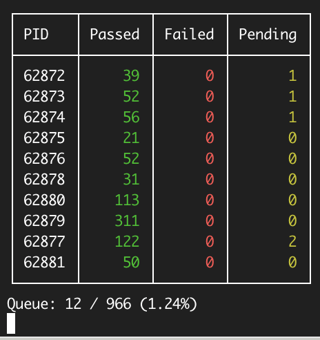

# Rspec::ProgressTable



RSpec::ProgressTable is an RSpec formatter that displays test progress in a table format during RSpec runs.

## Usage

    bundle add rspec-progress_table
    bin/rspec --require rspec/progress_table --format RSpec::ProgressTable::Formatter spec


Since it's a hassle to specify the options every time, you can add the following to your `.rspec` file and simply run `bin/rspec spec`:

    --require rspec/progress_table --format RSpec::ProgressTable::Formatter

## Using with test-queue

When using it together with [tmm1/test-queue](https://github.com/tmm1/test-queue), configure it like this:

```ruby
# ...

# Start the progress output server
# Suppress default output
require "rspec/progress_table/test_queue"
RSpec::ProgressTable::TestQueue.use

class FooRunner < TestQueue::Runner::RSpec
  # Send total number of spec files and current progress to the progress output server
  include ::RSpec::ProgressTable::TestQueue::Runner
end

FooRunner.new.execute
```

## Development

After checking out the repo, run `bin/setup` to install dependencies. Then, run `rake spec` to run the tests. You can also run `bin/console` for an interactive prompt that will allow you to experiment.

To install this gem onto your local machine, run `bundle exec rake install`. To release a new version, update the version number in `version.rb`, and then run `bundle exec rake release`, which will create a git tag for the version, push git commits and tags, and push the `.gem` file to [rubygems.org](https://rubygems.org).

## Contributing

Bug reports and pull requests are welcome on GitHub at https://github.com/labocho/rspec-progress_table.

